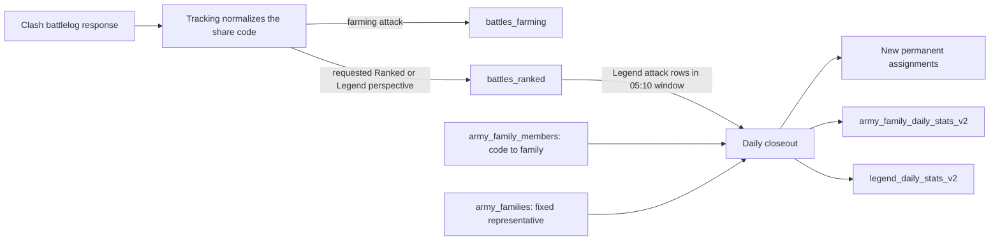

# Battle history and share-code army families

Migrations 008–013 establish retained raw battle history and the requested-player identity `(player_tag,battle_time)`. Migration 014 opens the nullable defense-loot transition. After the bounded cleanup, migration 015 adds share-code family identity and parallel daily tables for the new Legend-day meaning. Applied migrations 008, 009, 012, and 013 are never rewritten.

## Rollout order

1. Apply Goose through 014 only. This changes no rows.
2. Pause the old battlelog writer and keep it paused through the schema/binary cutover.
3. Run `go run ./migrations/clear_ranked_defense_loot.go` from `database/` first as a dry run, then with `RANKED_DEFENSE_LOOT_CLEANUP_APPLY=true`, `RANKED_BATTLELOG_WRITERS_PAUSED=true`, and `RANKED_DEFENSE_LOOT_CLEANUP_DATABASE=<exact database name>`. The companion requires Goose version 14, refuses compressed chunks, and commits bounded `(player_tag,battle_time)` batches.
4. Apply Goose through 015. It refuses to apply if any defense still has non-null loot.
5. Deploy compatible code-only battle ingestion and the new family closeout before resuming the writer. The old closeout must remain paused because its hash tables and old day semantics are no longer authoritative.
6. Populate and compare the `*_v2` aggregates from retained raw data before switching readers.

Migration 015 can roll back only while no new code-only rows, cleared defense rows, name edits, or v2 aggregates would be lost. Migration 014 cannot roll back while any ranked row contains null loot. Production execution and consumer deployment remain separate approvals.

## Data flow

Tracking stores only the requested player's perspective. It does not create the opposite side. All family and Legend statistics select `battle_mode='legend' AND direction='attack'`; a stored defense never contributes.

## Raw history

### `battles_farming`

| Column | Type | Null/default and rule |
|---|---|---|
| `player_tag` | `text` | required; primary key with `battle_time` |
| `battle_time` | `timestamptz` | required |
| `stars` | `smallint` | required; 0–3 |
| `destruction_percentage` | `smallint` | required; 0–100 |
| `duration_seconds` | `integer` | nullable; nonnegative |
| `looted_resources` | `jsonb` | required; default `{}`; nonnegative `gold`, `elixir`, and `darkElixir` only |
| `share_code` | `text` | nullable; nonblank when present |

New attack writes combine base and extra Gold, Elixir, and Dark Elixir into the same loot object. Sour Elixir is ignored. Existing attacks are not backfilled. The hypertable uses 30-day chunks, compression after 30 days, and one-year retention.

### `battles_ranked` after migration 015

| Column | Type | Null/default and rule |
|---|---|---|
| `player_tag` | `text` | required; primary key with `battle_time` |
| `battle_time` | `timestamptz` | required |
| `opponent_tag` | `text` | required; different from player |
| `direction` | `text` | required; `attack` or `defense` |
| `battle_mode` | `text` | required; `ranked` or `legend` |
| `player_town_hall` | `smallint` | required; 1–20 |
| `opponent_town_hall` | `smallint` | required; 1–20 |
| `stars` | `smallint` | required; 0–3 |
| `destruction_percentage` | `smallint` | required; 0–100 |
| `duration_seconds` | `integer` | nullable; nonnegative |
| `looted_resources` | `jsonb` | required object for attacks; SQL NULL for defenses |
| `share_code` | `text` | nullable canonical code; nonblank when present |
| `army_hash` | `bytea` | nullable legacy compatibility column; omitted by the new writer |

The primary key remains exactly `(player_tag,battle_time)`. No migration cleans the known minute-apart source duplicates because requested-player provenance cannot be reconstructed from SQL. Tracking reconciles those against live Clash battle logs.

The seven-day hypertable retains one year and compresses after 30 days. Existing player/time, player/mode/time, and player/direction/time indexes remain. The bounded attack aggregate index becomes `(battle_mode,battle_time DESC) WHERE direction='attack'`; full share codes are not indexed on every battle.

Detailed Ranked and Legend endpoints omit loot. The general player battle-history endpoint combines farming and ranked-table attacks, including Legend attacks, and may return the stored attack loot.

## Permanent family identity

### `army_families` after migration 015

| Column | Type | Null/default and rule |
|---|---|---|
| `family_id` | `bigint identity` | generated primary key; serialize as a decimal string in JSON |
| `representative_share_code` | `text` | required; unique; immutable |
| `name` | `text` | nullable manual name; normalized whitespace; maximum 120; unique case-insensitively |
| `hero_ids` | `integer[]` | required; default `{}`; sorted and duplicate-free; immutable |
| `equipment_ids` | `integer[]` | required; default `{}`; sorted and duplicate-free; immutable |
| `anchor_army_hash` | `bytea` | nullable legacy compatibility key; unique while retained |
| `family_name` | `text` | nullable legacy name |
| `source` | `text` | nullable legacy naming source |
| `named_by_subject` | `text` | nullable legacy provenance |
| `naming_model` | `text` | nullable legacy provenance |
| `naming_prompt_version` | `text` | nullable legacy provenance |
| `created_at` | `timestamptz` | required; default `now()` |
| `updated_at` | `timestamptz` | required; default `now()` |

Existing families keep their representative, assignment anchor, and normalized existing name. Hero/equipment filters are derived once from the retained representative composition. New families write only the code, optional name, and representative ID arrays; they do not calculate a hash or create an `army_compositions` row.

The insert compatibility trigger translates only old rows forward: when an old writer supplies `anchor_army_hash`, it copies the old name and derives representative ID arrays from the existing composition. It never synthesizes a hash. Updating `name` to NULL stays NULL because the trigger runs only on insert.

### `army_family_members` after migration 015

| Column | Type | Null/default and rule |
|---|---|---|
| `share_code` | `text` | primary key; canonical exact-army identity |
| `family_id` | `bigint` | required FK to `army_families` |
| `troop_similarity` | `numeric(5,4)` | required; 0.8600–1 inclusive |
| `spell_similarity` | `numeric(5,4)` | required; 0.8000–1 inclusive |
| `equipment_similarity` | `numeric(5,4)` | required; 0.7500–1 inclusive |
| `army_hash` | `bytea` | nullable legacy identity; unique while retained |
| `anchor_army_hash` | `bytea` | nullable legacy family link |
| `troop_housing_similarity` | `numeric(5,4)` | nullable legacy score |
| `spell_capacity_similarity` | `numeric(5,4)` | nullable legacy score |
| `heroes_exact` | `boolean` | nullable legacy field |
| `equipment_difference_count` | `smallint` | nullable legacy field |
| `matching_version` | `text` | nullable legacy field |
| `assigned_at` | `timestamptz` | retained legacy timestamp; default `now()` |

Assignments and representatives cannot be updated or deleted. New code-only inserts have no hash, matching-version, assignment-version, or equipment-difference requirement. An old hash-based insert is translated forward by looking up its existing composition code and family ID; the trigger never mirrors a new code row back into hash storage.

The application matcher requires exact hero IDs, housing-weighted main troops at least 0.86, capacity-weighted main plus clan-castle spells at least 0.80, and equipment overlap at least 0.75. Siege machines, clan-castle troops, and pets do not affect matching.

## Replacement daily tables

Old `army_family_daily_stats` and `legend_daily_stats` remain unchanged during compatibility because their prior day/tier/Town Hall meaning cannot be relabeled truthfully.

### `army_family_daily_stats_v2`

| Column | Type | Rule |
|---|---|---|
| `family_id` | `bigint` | FK; primary key with day |
| `day` | `date` | shifted day; primary key with family |
| `attack_count` | `bigint` | nonnegative |
| `distinct_player_count` | `bigint` | nonnegative |
| `zero_star_count` … `three_star_count` | `bigint` | nonnegative; sum to attacks |
| `destruction_percentage_sum` | `bigint` | 0 through 100 × attacks |
| `duration_seconds_sum` | `bigint` | nonnegative |
| `duration_count` | `bigint` | 0 through attack count |

Primary key: `(family_id,day)`. Index: `(day,family_id)`. Tracking stores every observed family, including families outside a daily top list. The table is permanent PostgreSQL storage without compression.

### `legend_daily_stats_v2`

| Column | Type | Rule |
|---|---|---|
| `day` | `date` | primary key |
| `attack_count` | `bigint` | nonnegative |
| `distinct_player_count` | `bigint` | nonnegative |
| `perfect_320_player_count` | `bigint` | 0 through player count |
| `zero_star_count` … `three_star_count` | `bigint` | nonnegative; sum to attacks |
| `destruction_percentage_sum` | `bigint` | 0 through 100 × attacks |
| `duration_seconds_sum` | `bigint` | nonnegative |
| `duration_count` | `bigint` | 0 through attack count |
| `hero_stats` | `jsonb` | required; default `[]`; sorted `{id,uses,triples}` |
| `pet_stats` | `jsonb` | same item shape |
| `equipment_stats` | `jsonb` | same item shape |
| `pet_hero_assignments` | `jsonb` | sorted `{petId,heroId,uses,triples}` |

Each item satisfies `0 <= triples <= uses <= attack_count`. Missing codes remain in global attack, star, destruction, duration, and player totals but cannot contribute decoded item or family data.

## Time and coverage contract

Day D owns the half-open window `[D 05:10:00 UTC, D+1 05:10:00 UTC)`. The proposed job starts at 05:12 UTC. Adjacent days neither overlap nor leave a gap.

Only stored Legend attack rows enter both v2 tables. Defenses, lower Ranked tiers, and synthetic opposite perspectives are excluded. Exact multi-day unique-player counts are supported only when the requested range is fully inside retained raw coverage and every completed day has a matching v2 global total, including explicit zero days. Otherwise the API reports player counts as unavailable and rejects a player-minimum filter.

## Deferred destructive cleanup

A separate migration may remove `army_compositions`, hashes, legacy family/member columns, old naming provenance, and old daily tables only after every reader and writer uses the code/family-ID contract and retained history has been rebuilt and compared. It must also swap the `*_v2` names to their final unsuffixed names. Older aggregates without sufficient raw history require an explicit preservation decision; migration 015 does not delete or relabel them.
