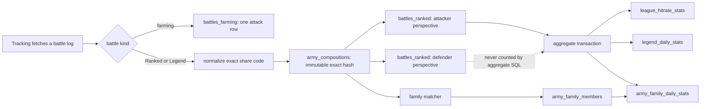

# Battle, league, and army-family storage

Migrations `008_ranked_battle_history.sql` and `009_league_army_analytics.sql` add the final battle pipeline. The legacy `battlelogs`, `townhall_stats_daily`, and `legend_history` relations remain during cutover. Migration 010 remains the independent CWL statistics migration.

## Write flow

The two Ranked rows make player history a direct `player_tag + battle_time` lookup. The attacker row is `#2PP -> #9G2YV, direction=attack`; the defender row is `#9G2YV -> #2PP, direction=defense`. Both describe one physical attack, so every aggregate insert or reconciliation query must include `WHERE direction = 'attack'`.

## Raw and identity tables

### `battles_farming`

One home-village attack per player and timestamp. It is a Timescale hypertable with 30-day chunks, compression after 30 days segmented by player and ordered by time, and one-year retention.

| Column | Type | Null/default and rule |
|---|---|---|
| `player_tag` | `text` | not null; canonical tag; PK |
| `battle_time` | `timestamptz` | not null; PK |
| `stars` | `smallint` | not null; 0–3 |
| `destruction_percentage` | `smallint` | not null; 0–100 |
| `duration_seconds` | `integer` | nullable; nonnegative |
| `looted_resources` | `jsonb` | not null, default `{}`; optional nonnegative `gold`, `elixir`, `darkElixir` integer keys only |
| `share_code` | `text` | nullable; nonblank when present |

### `battles_ranked`

Two player-perspective rows per physical Ranked or Legend attack. It is a Timescale hypertable with seven-day chunks, compression after 30 days segmented by `(player_tag,direction)` and ordered by time, and one-year retention.

| Column | Type | Null/default and rule |
|---|---|---|
| `player_tag` | `text` | not null; canonical perspective owner; PK |
| `opponent_tag` | `text` | not null; canonical opponent; PK |
| `battle_time` | `timestamptz` | not null; PK |
| `direction` | `text` | not null; `attack` or `defense`; PK |
| `battle_mode` | `text` | not null; `ranked` or `legend`; PK |
| `player_town_hall` | `smallint` | not null; 1–20 |
| `opponent_town_hall` | `smallint` | not null; 1–20 |
| `stars` | `smallint` | not null; 0–3 |
| `destruction_percentage` | `smallint` | not null; 0–100 |
| `duration_seconds` | `integer` | nullable; nonnegative |
| `looted_resources` | `jsonb` | not null, default `{}`; same shape as farming |
| `share_code` | `text` | nullable; normalized code used by the attack |
| `army_hash` | `bytea` | not null; 32-byte FK to `army_compositions` |

The primary key is `(player_tag,battle_time,battle_mode,direction,opponent_tag)`. The mode is explicit because Ranked-season and Legend-day windows can overlap; time cannot identify the source losslessly. `idx_battles_ranked_player_time` serves all of a player's attacks and defenses, `idx_battles_ranked_player_mode_time` serves exact mode history, `idx_battles_ranked_player_direction_time` serves direction-filtered history, and the partial `idx_battles_ranked_attacks_time` serves mode-specific aggregate scans while physically excluding defense rows.

### `army_compositions`

One immutable exact army definition. `army_hash` is SHA-256 of the normalized share code according to `contracts/army-hash-v2.json`; it is separate from family similarity.

| Column | Type | Null/default and rule |
|---|---|---|
| `army_hash` | `bytea` | not null; 32-byte PK |
| `normalized_share_code` | `text` | not null; unique and nonblank |
| `main_troops` | `jsonb` | not null, default `[]`; sorted unique `{id,quantity}` rows |
| `clan_castle_troops` | `jsonb` | not null, default `[]`; sorted unique `{id,quantity}` rows |
| `spells` | `jsonb` | not null, default `[]`; sorted unique `{id,quantity,clanCastle}` rows |
| `heroes` | `integer[]` | not null, default `{}`; sorted unique hero IDs |
| `equipment` | `jsonb` | not null, default `[]`; sorted unique `{equipmentId,heroId}` rows |
| `pet_assignments` | `jsonb` | not null, default `[]`; sorted unique `{petId,heroId}` rows |
| `siege_machine_id` | `integer` | nullable; nonnegative |
| `created_at` | `timestamptz` | not null, default `now()` |

## League snapshots and aggregate tables

### `ranked_league_group_members`

This existing table remains the only Ranked group relation; there is no `ranked_league_groups` table. Its primary key remains `(season_id,group_tag,player_tag)`, and `UNIQUE (season_id,player_tag)` lets ingestion replace a stale group tag rather than creating a second membership for the same season. During upgrade, existing duplicates are reduced deterministically because the old schema has no observation timestamp: the row with the greatest combined attack/defense result count wins, followed by trophies, tier, placement, and group tag as stable tie-breakers. Counters from different group snapshots are not combined.

| Column | Type | Null/default and rule |
|---|---|---|
| `season_id` | `bigint` | not null; PK |
| `group_tag` | `text` | not null; PK |
| `league_tier_id` | `integer` | not null; positive |
| `player_tag` | `text` | not null; PK |
| `player_name` | `text` | not null |
| `town_hall` | `smallint` | nullable; 1–20 |
| `placement` | `integer` | not null; positive |
| `league_trophies` | `integer` | not null; nonnegative |
| `maximum_battle_count` | `smallint` | not null, default 0 |
| `attack_win_count` | `integer` | not null; source counter |
| `attack_loss_count` | `integer` | not null; source counter |
| `attack_star_count` | `integer` | not null, default 0; source counter |
| `defense_win_count` | `integer` | not null; source counter |
| `defense_loss_count` | `integer` | not null; source counter |
| `defense_star_count` | `integer` | not null, default 0; source counter |

The old clan snapshot columns are removed because the group-member response does not need a second clan identity copy. No lifecycle flags, inferred promotions, missing markers, or state column are stored.

### `league_hitrate_stats`

Permanent hit-rate totals. Primary key: `(period_kind,period_start,league_tier_id,town_hall)`.

| Column | Type | Rule |
|---|---|---|
| `period_kind` | `text` | `ranked_season` or `legend_day` |
| `period_start` | `timestamptz` | exact period boundary |
| `league_tier_id` | `integer` | positive |
| `town_hall` | `smallint` | 1–20 |
| `attack_count` | `bigint` | equals the four star buckets |
| `zero_star_count`…`three_star_count` | `bigint` | nonnegative |
| `refreshed_at` | `timestamptz` | default `now()` |

### `ranked_league_tier_stats`

Permanent per-season/tier population and trophy distribution. Primary key: `(season_id,league_tier_id)`.

| Columns | Types and rules |
|---|---|
| `season_id`, `league_tier_id` | `bigint`, `integer`; positive |
| `group_count`, `distinct_player_count`, `participating_player_count` | `bigint`; nonnegative; participating cannot exceed distinct |
| `trophy_p10`, `trophy_p25`, `trophy_p50`, `trophy_p75`, `trophy_p90` | nullable `integer`; ordered when present |
| `town_halls` | `jsonb`; descending `[{"level":17,"count":123}]` |
| `average_group_first_last_trophy_range`, `average_first_second_trophy_gap` | nullable nonnegative `numeric` |
| `refreshed_at` | `timestamptz`, default `now()` |

### `legend_daily_stats`

Permanent per-day/tier/TH totals. Primary key: `(day,league_tier_id,town_hall)`. It stores attack/player/perfect-320 counts, four star buckets, destruction and duration sums, plus `hero_stats`, `pet_stats`, and `equipment_stats` arrays of `{id,uses,triples}`. `pet_hero_assignments` is sorted `{petId,heroId,uses,triples}` data using numeric IDs.

These four aggregate relations are normal PostgreSQL tables. They have no Timescale compression or retention policy.

## Army families

Exact hashes remain immutable. The matcher assigns an exact hash to a family only when main troops are at least 86% similar by housing space, all spells including clan-castle spells are at least 80% similar by spell capacity, hero IDs match exactly, and equipment is at least 75% similar with at most two differences. Clan-castle troops, pets, and siege machines do not affect family matching; pet usage remains available in `legend_daily_stats`.

### `army_families`

The primary key is the exact `anchor_army_hash`, and `(anchor_army_hash,representative_share_code)` must resolve to one `army_compositions` row. `family_name` is case-insensitively unique. `source` is `ai` with model/prompt provenance, `admin` with the naming subject, or `fallback` with null naming provenance when inference fails or collides. The anchor and representative code cannot change; metadata can be renamed and `updated_at` is touched by the schema.

### `army_family_members`

One immutable assignment per exact `army_hash`. It stores `anchor_army_hash`, troop/spell/equipment similarity values, `heroes_exact`, `equipment_difference_count`, `matching_version`, and `assigned_at`. Constraints enforce the approved 86%/80%/exact/75%/two-difference minimums.

### `army_family_daily_stats`

Permanent daily family totals keyed by `(anchor_army_hash,day)`: attack and distinct-player counts, four star buckets, destruction sum, duration sum, and `refreshed_at`. It is a normal PostgreSQL table with no compression policy.
