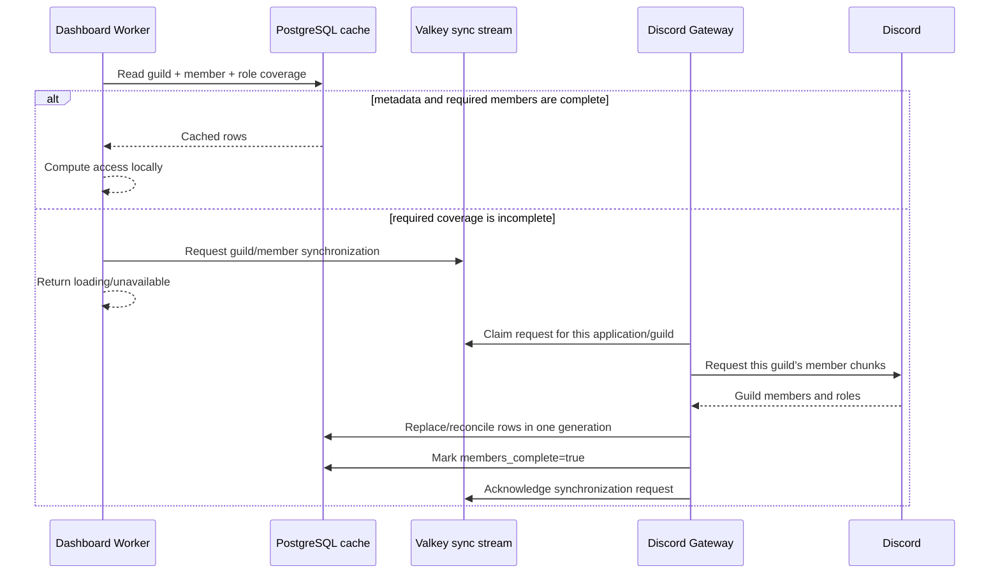
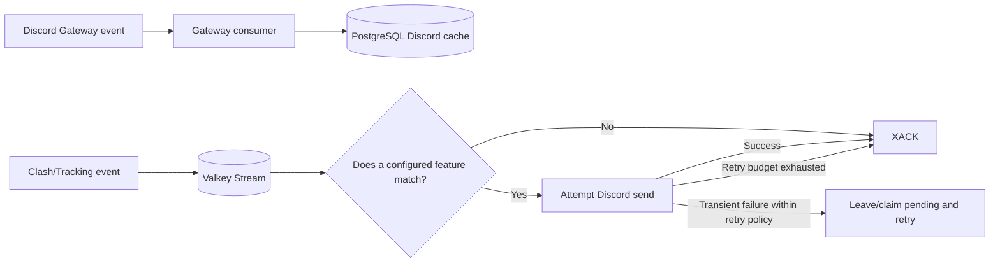
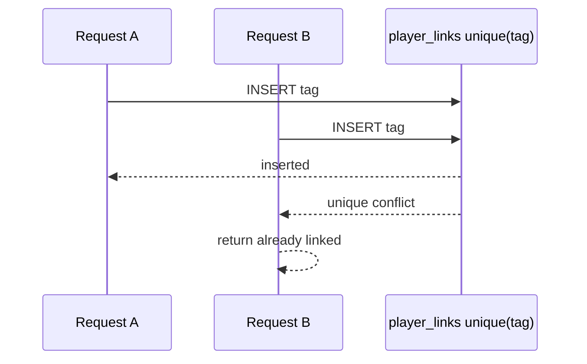

# Worker/API migration 007

Baseline: DevKit main after PR #19 (`a7bb9f4`), compared with rewrite handoff
`c8f74fd`. Keep the full DevKit checkout restored on main; consolidate only the
unapplied migrations. Files 001–006 must remain byte-for-byte unchanged.

Except for the explicitly removed coordination tables below, Up bodies of former 007, 008, 009, 010, 012, 013, 020, 022, 023, 027 and 028
are retained in order, including constraints, indexes, Capital Gold materialized
view refresh, billing backfill/default transition.
All run in one transaction. Down deliberately fails because deleting operation
identities and enabled linking policies cannot safely restore prior behavior.

New tables: app_update_channels, app_update_installations,
billing_customer_operations (public schema); gateway_shards, guilds,
channels, users, members, roles, and application_emojis (discord_cache schema).

Existing data changes: basic_clan.capital_gold_total plus global/location ranks;
app_update_channels.rollback_target_version; billing_subscriptions.
initial_assignment_applied (true for existing rows, false for new rows); servers.
require_api_token_when_linking (false for existing and new servers).

## Ticket configuration decision

007 now includes the approved stable-identity portion of the earlier proposal.
Panels gain id UUID (primary key) and archived_at. Active names remain unique
within a server through a partial unique index; names are editable. Existing
normalized panel/button UUIDs are reused when unambiguous, and legacy-only
panels are preserved as archived history. tickets.panel_id references canonical
ticket_panels with server scope. Panel deletion is rejected; archive instead.

Buttons receive internal UUIDs in components JSON. Existing Discord custom_id
values and corresponding data settings keys are preserved, avoiding an automatic
rewrite of posted controls. Configuration checks require UUIDs and unique
component/custom IDs; existing identity pairs cannot be reassigned in an update.
Archived configuration is not frozen by an additional trigger. There is no
runtime-table prerequisite. No new button-history table is introduced.

Consumer cutover is required: use panel IDs for mutations, filter active panels
with archived_at IS NULL, archive rather than delete, preserve button IDs on
edits, and use ON CONFLICT(server_id,name) WHERE archived_at IS NULL if retaining
name-based creation. The original broader 017 remains a verbatim reference in
docs/deferred; it is not separately applied. Reopening old controls after panel
renames still needs the Bot's routing contract to use stable identity; SQL alone
cannot change an existing name-based custom_id parser.

## Approved coordination simplification

The user approved omitting player_link_mutation_locks and roster_ai_budget_locks.
First successful link wins using the existing unique player_links.tag constraint
and explicit conflict handling; verified ownership transfer still requires
transaction-safe cleanup. AI admission may overlap slightly around budget limits;
settlement still needs idempotency and correct atomic credit allocation. The
singleton lock never reserved future spend at zero-cost authorization.

The user also directed Discord delivery through Valkey Streams, so 007 omits
Discord delivery_receipts. Consumers filter events and acknowledge events with
no matching action; outbound retries belong to the stream consumer. The former
SQL receipt logic did not guarantee exactly-once delivery.

Deploy prerequisite: update all retained API references to the two removed lock
tables and Tracking discord_delivery.go references to delivery_receipts before
starting those consumers against 007. The API task has been notified of these
explicit user decisions. This DevKit PR does not modify consumer checkouts.

The user also approved omitting subject_mutation_locks and
discord_managed_resources. Use targeted existing-row locks/constraints for
subject mutations. General configuration removal does not delete Discord
resources. Countdown-created voice channels alone have an explicit feature
cleanup path; there is no general resource deletion ledger.

## Gateway cache and lazy guild synchronization

The Gateway is the only component that builds Discord guild state. The Dashboard
reads that state from PostgreSQL; it does not independently rebuild a guild by
calling Discord. This keeps one ordered Discord view and avoids two services
competing for the same REST limits.



At startup, Discord's READY/GUILD_CREATE flow supplies the guild and role
metadata the bot receives, but it does not guarantee that every large guild's
complete member list is resident. `discord_cache.guilds.metadata_complete` and
`members_complete` therefore mean different things. A settings page that only
needs channels and roles can proceed after metadata is complete. A permission
check that needs the user's member row waits for member coverage.

The synchronization request is an ephemeral Valkey Stream message, for example:

```json
{
  "applicationId": "1234567890",
  "guildId": "9876543210",
  "coverage": "members",
  "reason": "dashboard-access",
  "requestId": "0195d6f8-2f38-7f4a-a941-7bb25b825e68"
}
```

The Gateway deduplicates concurrent requests for the same guild, prioritizes
that guild for Discord member chunking, writes the result, and continues applying
member add/update/remove events afterward. It does not chunk every guild at
startup. A disconnect or sequence gap sets the affected shard/guild coverage to
unavailable until reconciliation; stale rows remain useful for diagnosis but
cannot prove that a user currently has or lacks access.

`gateway_shards` records which application/shard generation is authoritative and
the last sequence durably applied. `guilds` carries availability and coverage
flags. `channels`, `users`, `members`, and `roles` hold the Discord objects. The
Gateway must finish the database write before advancing its heartbeat/sequence,
so a healthy marker never advertises data that is still in flight.

OAuth discovery is separate: the user's OAuth guild list can show guilds where
the bot is absent, because the Gateway cannot cache a guild it has never joined.
Once the bot is present, Dashboard authorization uses the Gateway cache.

The proposed `dashboard_access` cache is unnecessary in this design. Access is
derived from the current member and role rows, while incomplete coverage produces
a synchronization request. `request_limits` also should not be PostgreSQL state:
the Gateway owns routine Discord fetching, and any short-lived cross-worker
cooldown belongs beside the Valkey work queue. Remove both tables together with
their Worker callers rather than leaving two independent cache authorities.

## Best-effort Discord event delivery

There are two different event paths. Discord Gateway events update the cache;
ClashKing domain events can cause outbound Discord messages. Valkey Streams is
the handoff for both work queues, while PostgreSQL stores durable product data.



For example, Tracking publishes one `war.started` event. The Discord sender reads
the event, finds configured war-log destinations, and attempts those sends. Most
events may match no destination; the consumer simply acknowledges them. With the
approved best-effort behavior, the stream only needs to answer whether the event
is still pending for this consumer group. It does not need a SQL row saying that
destinations A and B succeeded while C failed.

A crash after Discord accepts a message but before `XACK` can produce a duplicate
on retry; acknowledging before the send can lose a message on a crash. The design
accepts that narrow best-effort window instead of adding `delivery_receipts`,
which had the same send-versus-commit window and therefore did not provide true
exactly-once delivery anyway.

Configuration changes use a smaller best-effort wake path. The API calls
`pg_notify('tracking_wake', payload)` inside the same SQL transaction that changes
a reminder, mobile reminder preference, or guild reactivation. PostgreSQL emits
the notification only if that transaction commits. Tracking keeps a dedicated
`LISTEN tracking_wake` connection and immediately reconciles the named scope.
Notifications are not retained while Tracking is disconnected, so the existing
five-minute reconciliation loop remains the recovery path. There is no outbox or
retry table because a missed wake delays reconciliation; it does not lose the
configuration row that PostgreSQL already committed.

An illustrative payload is deliberately small and identifies work rather than
copying the changed configuration:

```json
{"kind":"reminder_config","aggregateKey":"guild:1234567890"}
```

## Coordination without mutex tables

`player_link_mutation_locks`, `subject_mutation_locks`, and
`roster_ai_budget_locks` do not hold product state, so they are omitted.

For a first player link, two requests may race like this:



The unique constraint chooses the winner, including when no row existed to lock.
Verified transfers run as a transaction: lock the existing ownership row, verify
the transfer preconditions again, update dependent ownership, and retry or reject
if the row changed. A rare collision becomes a normal conflict response rather
than a permanent coordination row.

Subject/account mutations use the same pattern: lock an existing auth/account row
when one exists, rely on unique and foreign-key constraints for creation races,
and retry serialization conflicts. If there is no durable subject row and two
requests race, only the operation whose constrained writes succeed commits.

AI authorization may read a slightly stale budget and allow small overlap near
the limit. Settlement still uses an immutable request/operation identity so the
same charge cannot be recorded twice, and balance allocation uses an atomic
conditional update. The removed singleton lock serialized every authorization
but never reserved that future spend, so it did not make the zero-cost admission
check exact.

## Discord resource ownership and cleanup

There is no general `discord_managed_resources` ledger and disabling ordinary
configuration never deletes a Discord channel, role, or webhook. The Gateway
cache answers whether a resource exists, while the feature configuration holds
the selected resource ID.

Countdown voice channels are the narrow exception because that feature creates
the channel itself. The creation result is written directly to the countdown
configuration. On removal, the Dashboard can ask whether to delete that recorded
channel; the backend verifies that it is still the configured countdown channel
before issuing the delete. This gives the only automatic-delete path all the
ownership evidence it needs without a generic resource table.

## Stable ticket identities

Today, a live panel is effectively addressed by `(server_id, name)`. Renaming it
therefore changes the lookup key, and deleting it can break a historical ticket's
foreign key or leave an old Discord button pointing at a name that now means
something else.

Migration 007 assigns each panel a UUID and each component/button an internal
UUID. Names remain editable display/lookup values and active names remain unique
within a server. Deleting becomes `archived_at = now()`, so an old ticket keeps a
valid panel identity while normal lists filter `archived_at IS NULL`.

```text
Before rename
panel key: (server 42, "Support")
button route: name=Support, custom_id=open-billing

After stable identity migration and rename
panel id: 0195...e68       name: "Billing Support"
button id: 0195...c21      Discord custom_id: open-billing (preserved)
old ticket.panel_id: 0195...e68 (still valid)
```

The migration reuses normalized UUIDs when the old JSON and normalized copies
match unambiguously, generates missing IDs, and archives normalized-only panels
so referenced history survives. A trigger prevents reassignment of a panel UUID
or an existing button UUID/custom-id pair. It does not freeze archived JSON, add
a button-history table, or rewrite already-posted Discord custom IDs.

Consumer cutover is still required. Dashboard mutations must address the panel
UUID, preserve component UUIDs while editing, archive rather than delete, and
filter active rows. Bot routing must carry or resolve the stable identity before
renaming can be guaranteed to keep already-posted buttons working; SQL cannot
reinterpret an old name-based custom ID on its own.
